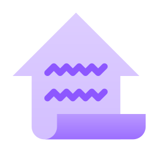

<h1>HouseForm</h1>

Simple to use React forms, where your validation and UI code live together in harmony.

**Visit [https://houseform.dev/](https://houseform.dev/) to get started with HouseForm.**

## Contributing

If you've ever wanted to contribute to open source, now is your chance!

See the [contributing docs](./CONTRIBUTING.md) for more information

## Contributors

Thanks goes to these wonderful people
([emoji key](https://allcontributors.org/docs/en/emoji-key)):

<!-- ALL-CONTRIBUTORS-LIST:START - Do not remove or modify this section -->
<!-- prettier-ignore-start -->
<!-- markdownlint-disable -->
<table>
  <tbody>
    <tr>
      <td align="center" valign="top" width="14.28%"><a href="https://crutchcorn.dev/"> <b>Corbin Crutchley</b></a> <a href="https://github.com/houseform/houseform/commits?author=crutchcorn" title="Code">💻</a> <a href="https://github.com/houseform/houseform/commits?author=crutchcorn" title="Documentation">📖</a> <a href="#maintenance-crutchcorn" title="Maintenance">🚧</a> <a href="https://github.com/houseform/houseform/commits?author=crutchcorn" title="Tests">⚠️</a></td>
      <td align="center" valign="top" width="14.28%"><a href="http://pratti.design/"> <b>Eduardo Pratti</b></a> <a href="#design-PrattiDev" title="Design">🎨</a></td>
      <td align="center" valign="top" width="14.28%"><a href="https://github.com/emkay"> <b>Michael Matuzak</b></a> <a href="https://github.com/houseform/houseform/commits?author=emkay" title="Documentation">📖</a></td>
      <td align="center" valign="top" width="14.28%"><a href="https://jamesperkins.dev/"> <b>James Perkins</b></a> <a href="https://github.com/houseform/houseform/commits?author=perkinsjr" title="Documentation">📖</a> <a href="#video-perkinsjr" title="Videos">📹</a></td>
      <td align="center" valign="top" width="14.28%"><a href="https://github.com/gitname"> <b>gitname</b></a> <a href="https://github.com/houseform/houseform/commits?author=gitname" title="Documentation">📖</a></td>
      <td align="center" valign="top" width="14.28%"><a href="https://chasingtherain.vercel.app/"> <b>ChasingRain</b></a> <a href="https://github.com/houseform/houseform/commits?author=chasingtherain" title="Code">💻</a> <a href="https://github.com/houseform/houseform/commits?author=chasingtherain" title="Documentation">📖</a> <a href="https://github.com/houseform/houseform/commits?author=chasingtherain" title="Tests">⚠️</a></td>
      <td align="center" valign="top" width="14.28%"><a href="https://github.com/nordowl"> <b>Jonas D.</b></a> <a href="https://github.com/houseform/houseform/commits?author=nordowl" title="Documentation">📖</a></td>
    </tr>
    <tr>
      <td align="center" valign="top" width="14.28%"><a href="http://shivan.xyz"> <b>Shivan Sivakumaran</b></a> <a href="https://github.com/houseform/houseform/commits?author=shivan-s" title="Documentation">📖</a></td>
      <td align="center" valign="top" width="14.28%"><a href="http://charlesfig.github.io"> <b>Carlos</b></a> <a href="https://github.com/houseform/houseform/commits?author=charlesfig" title="Code">💻</a> <a href="https://github.com/houseform/houseform/commits?author=charlesfig" title="Tests">⚠️</a></td>
    </tr>
  </tbody>
</table>

<!-- markdownlint-restore -->
<!-- prettier-ignore-end -->

<!-- ALL-CONTRIBUTORS-LIST:END -->

This project follows the
[all-contributors](https://github.com/all-contributors/all-contributors)
specification. Contributions of any kind welcome!
